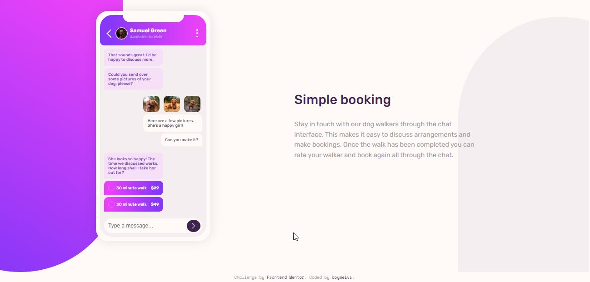

# Frontend Mentor - Chat app CSS illustration solution

## Table of contents

-  [Overview](#overview)
   -  [The challenge](#the-challenge)
   -  [Screenshot](#screenshot)
   -  [Links](#links)
   -  [Built with](#built-with)
-  [Author](#author)

## Welcome! 👋

Thanks for checking out this front-end coding challenge.

## Overview

This is a solution to the [Chat app CSS illustration challenge on Frontend Mentor](https://www.frontendmentor.io/challenges/chat-app-css-illustration-O5auMkFqY).

### The challenge

Users should be able to:

-  View the optimal layout for the component depending on their device's screen size
-  **Bonus**: See the chat interface animate on the initial load

### Screenshot

### Links

-  Live Site URL: [Chat app CSS illustration solution](https://boymelvs.github.io/chat-app-css-illustration-master)

### Built with

-  HTML
-  Flexbox
-  CSS

## Author

-  Frontend Mentor - [Melvin](https://www.frontendmentor.io/profile/boymelvs)
